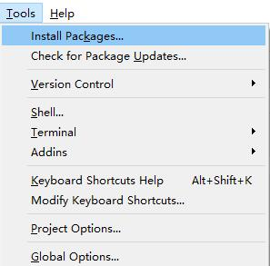
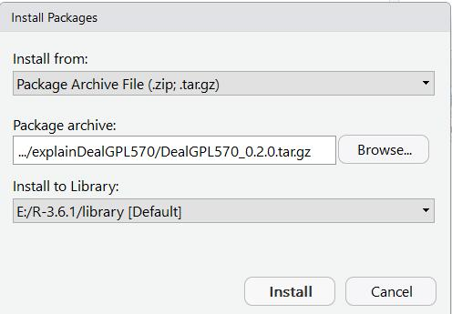
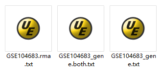

```{r setup, include=FALSE}
knitr::opts_chunk$set(echo = TRUE)
```

## GPL570数据分析流程及DealGPL570包的使用说明
***
### 1. 从GSE数据库下载所有GPL570平台的RAW.tar文件（原始数据），可以用以下函数得到GSExxxx的原始数据的url直接扔进迅雷即可！
```{r}
get_GSE_links <- 
  function(studyID) {
    supp_link = paste0("ftp://ftp.ncbi.nlm.nih.gov/geo/series/", substr(studyID, 1, nchar(studyID) - 3), "nnn/", 
                       studyID, "/suppl/", studyID, "_RAW.tar")
    meta_link = paste0("http://www.ncbi.nlm.nih.gov/geo/browse/?view=samples&mode=csv&series=", substr(studyID, 
                                                                                                       4, nchar(studyID)))
    matrix_link = paste0("ftp://ftp.ncbi.nlm.nih.gov/geo/series/", substr(studyID, 1, nchar(studyID) - 3), "nnn/", 
                         studyID, "/matrix/", studyID, "_series_matrix.txt.gz")
    return(supp_link)
  }
```
***
```{r}
get_GSE_links("GSE104683")
```
***
```{r}
## 可以批量，批量输出到文档里，扔进迅雷，边搞科研边等吧
get_GSE_links(c("GSE104683", "GSE1145"))
```
***
上面的链接放进迅雷就得到  
  

***
### 2. DealGPL570包使用，直接R本地安装，需要另外自行安装bioconductor包GEOquery和affy；然后本地安装DealGPL570。（注：把R起码升级到3.5.0）
***

```{r eval=FALSE}
options("repos" = c(CRAN="https://mirrors.tuna.tsinghua.edu.cn/CRAN/"))
install.packages("BiocManager")

options(BioC_mirror = "https://mirrors.ustc.edu.cn/bioc/")
if(!requireNamespace("affy")){
  BiocManager::install("affy")
}

if(!requireNamespace("GEOquery")){
  BiocManager::install("GEOquery")
}
```
***
本地安装，先打开RStudio  
   

***
也可以用install.packages在线安装，不过因为CRAN policy我做了一些改动  
  

***
```{r}
library(DealGPL570)
```
```{r eval=FALSE}
## 查看帮助文档，一定要学会看帮助文档或者vignettes
?DealGPL570
```
```{r}
## 具体使用方法
## 我在R包里面放了一个GSE*_RAW.tar，只有一个样本，方便演示
file <- system.file("extdata", "GSE104683_RAW.tar", package = "DealGPL570")
file
```
```{r}
## 所以DealGPL570的输入就是一个string，你电脑里面GSE*_RAW.tar的path
DealGPL570(file = file)
```
***
然后你会发现在你的working directory出现了3个txt文件  
  

***

### 3. 结果文件说明
```{r}
if(!requireNamespace("data.table")){
  install.packages("data.table")
}
```
```{r}
list.files(pattern = "GSE104683.*.txt")
```
***
我们分别看看这3个文件是什么  

***
```{r}
## GPL570探针的表达值
data.table::fread("GSE104683.rma.txt")
```
```{r}
## GPL570探针和探针所对应的基因的表达值（会出现多个探针对应一个基因的情况）
data.table::fread("GSE104683_gene.both.txt")
```
```{r}
##  GPL570基因的表达值（多个探针对应一个基因时取这些探针的median来当作该基因的表达值）
data.table::fread("GSE104683_gene.txt")
```
***
探针基因对应关系在
```{r}
head(DealGPL570:::probe2symbol_df)
```
***
### 4. 代码鉴赏环节

```{r}
DealGPL570
```

